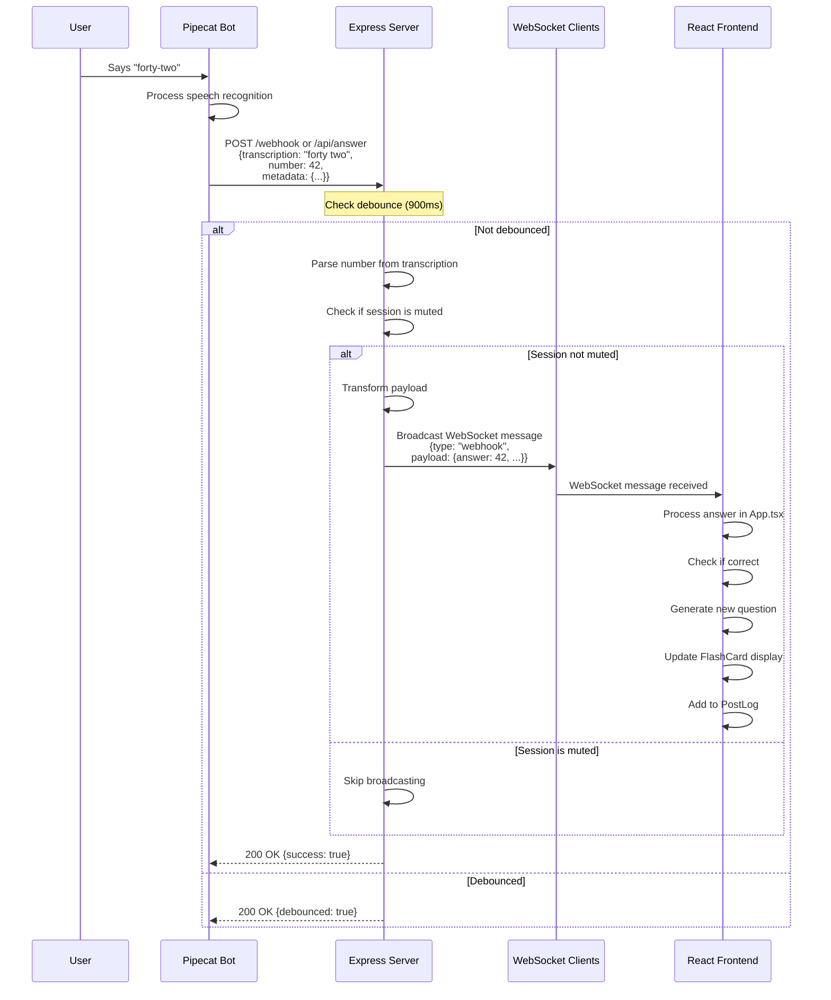
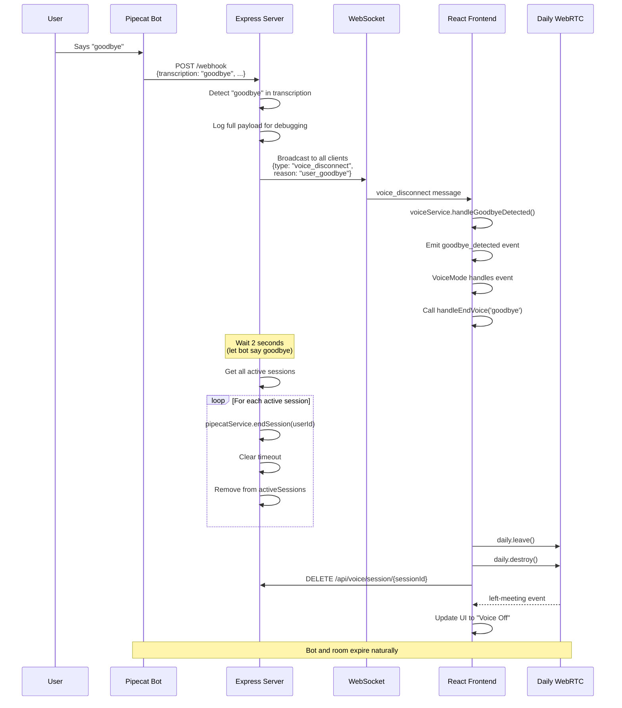
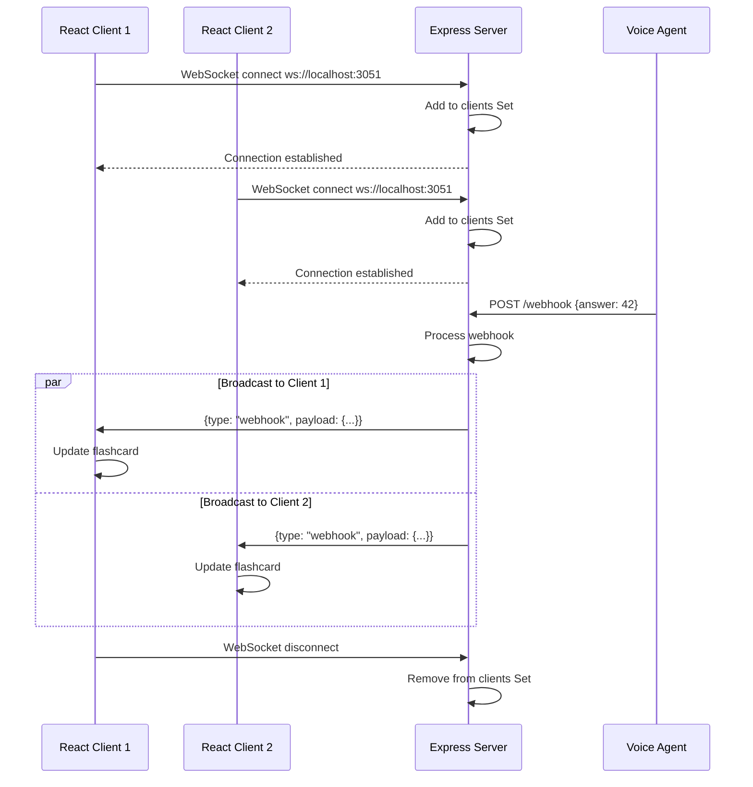
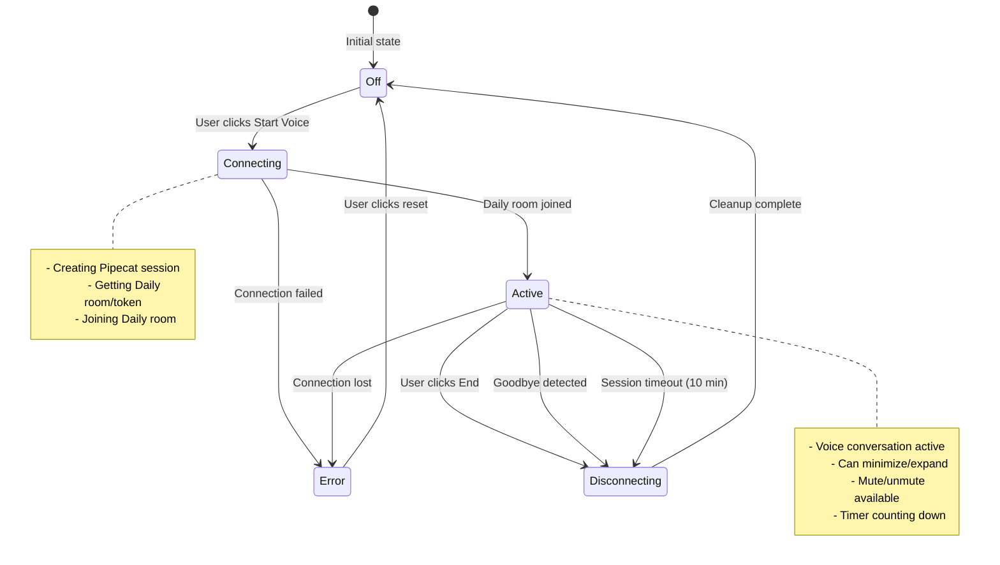
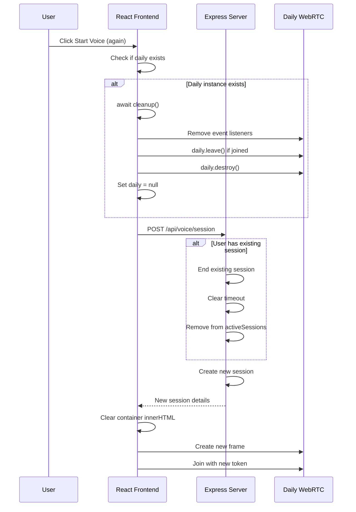
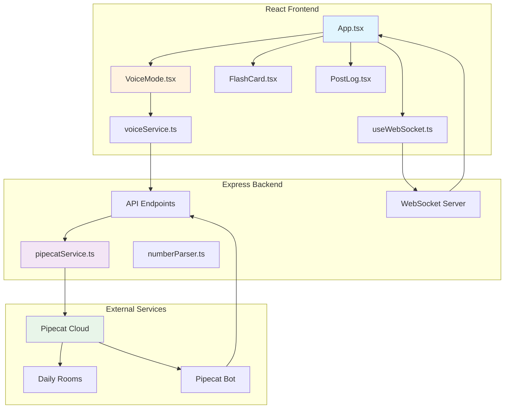
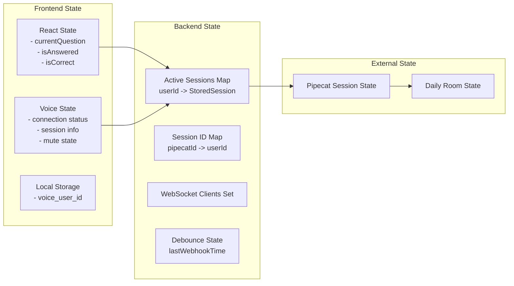

# Flashcard App Architecture & Data Flow Diagrams

## 1. Voice Session Initialization Flow

```mermaid
sequenceDiagram
    participant User
    participant React as React Frontend
    participant Express as Express Server
    participant Pipecat as Pipecat Cloud
    participant Daily as Daily WebRTC
    participant Bot as Pipecat Bot

    User->>React: Click "Start Voice Mode"
    React->>React: voiceService.startSession()
    React->>Express: POST /api/voice/session<br/>{userId: "user-123"}
    
    Note over Express: Check for existing session,<br/>end it if exists
    
    Express->>Pipecat: POST /v1/public/my-first-agent/start<br/>{createDailyRoom: true,<br/>metadata: {userId, webhookUrl}}
    Pipecat->>Daily: Create room automatically
    Daily-->>Pipecat: Room created
    Pipecat->>Bot: Start bot instance
    Bot->>Daily: Bot joins room
    
    Pipecat-->>Express: {dailyRoom: "https://...",<br/>dailyToken: "eyJ...",<br/>sessionId: "..."}
    
    Note over Express: Store session in memory<br/>Set 10-minute timeout
    
    Express-->>React: {sessionId: "session-user-123-...",<br/>roomUrl: "https://...",<br/>token: "eyJ...",<br/>expiresAt: ...,<br/>remainingTime: 600000}
    
    React->>Daily: DailyIframe.createFrame()
    React->>Daily: daily.join({url, token})
    Daily-->>React: joined-meeting event
    React->>React: Update UI to "Voice Active"
    
    User<->Bot: Voice conversation via WebRTC
```

## 2. Voice Answer Processing Flow



## 3. Goodbye Detection & Session Termination Flow



## 4. WebSocket Real-time Communication Flow



## 5. Session Lifecycle Management



## 6. Error Recovery Flow



## 7. Component Communication Architecture



## 8. Data Store & State Management



## Key Integration Points

### 1. **Webhook Endpoint** (`/webhook`, `/api/answer`)
- Receives answers from Pipecat bot
- Implements 900ms debouncing
- Parses spoken numbers
- Broadcasts via WebSocket

### 2. **Voice Session API** (`/api/voice/*`)
- Creates Pipecat sessions
- Manages session lifecycle
- Handles mute state
- Tracks session timeouts

### 3. **WebSocket Server** (port 3051)
- Real-time answer broadcasting
- Voice disconnect notifications
- Multiple client support

### 4. **Daily WebRTC Integration**
- Voice/video communication
- Room management
- Token-based authentication
- Network quality monitoring

## Environment Dependencies

```yaml
Backend (.env):
  PIPECAT_API_KEY: Public API key for Pipecat Cloud
  PIPECAT_AGENT_NAME: Agent identifier (my-first-agent)
  WEBHOOK_URL: Public URL for bot callbacks
  PORT: 3051

Frontend (.env):
  REACT_APP_WS_URL: WebSocket server URL
  REACT_APP_API_URL: Backend API URL
```

## Error Handling Strategies

1. **Connection Failures**: Automatic reconnection with 3-second delay
2. **Session Conflicts**: End existing session before creating new
3. **Cleanup Failures**: Force cleanup with finally blocks
4. **Network Issues**: Voice level smoothing, quality warnings
5. **Timeout Management**: 10-minute hard limit with warnings

## Security Considerations

1. **Token-based Auth**: Daily rooms require tokens
2. **Session Isolation**: Each user gets unique session
3. **Rate Limiting**: 900ms webhook debouncing
4. **Private Rooms**: Daily rooms set to private
5. **Cleanup on Shutdown**: All sessions ended on SIGTERM/SIGINT