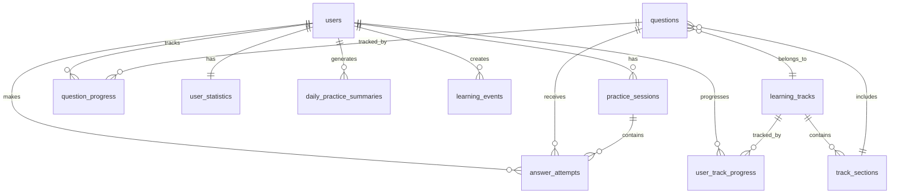

# Math Learning Engine Database Schema

## Overview
This document describes the database implementation of the Math Learning Engine schema, including table structures, relationships, indexes, and data flow.

## Database Tables

### 1. Core Tables

#### `questions`
Primary table for storing math questions.

```sql
CREATE TABLE questions (
    id UUID PRIMARY KEY DEFAULT gen_random_uuid(),
    operand1 INTEGER NOT NULL,
    operand2 INTEGER NOT NULL,
    operand3 INTEGER,
    operation VARCHAR(10) NOT NULL,
    operation2 VARCHAR(10),
    correct_answer DECIMAL(10,2) NOT NULL,
    difficulty VARCHAR(20) NOT NULL,
    category VARCHAR(50) NOT NULL,
    track_id UUID REFERENCES learning_tracks(id),
    sequence_number INTEGER NOT NULL,
    display_format VARCHAR(20) DEFAULT 'horizontal',
    units VARCHAR(50),
    hint TEXT,
    explanation TEXT,
    visual_aid_url TEXT,
    tags TEXT[],
    created_at TIMESTAMP DEFAULT CURRENT_TIMESTAMP,
    updated_at TIMESTAMP DEFAULT CURRENT_TIMESTAMP,
    
    INDEX idx_track_sequence (track_id, sequence_number),
    INDEX idx_difficulty (difficulty),
    INDEX idx_operation (operation),
    INDEX idx_operands (operand1, operand2, operation)
);
```

#### `answer_attempts`
Records every answer attempt made by users.

```sql
CREATE TABLE answer_attempts (
    id UUID PRIMARY KEY DEFAULT gen_random_uuid(),
    question_id UUID REFERENCES questions(id) NOT NULL,
    user_id UUID REFERENCES users(id) NOT NULL,
    session_id UUID REFERENCES practice_sessions(id) NOT NULL,
    user_answer DECIMAL(10,2) NOT NULL,
    is_correct BOOLEAN NOT NULL,
    correct_answer DECIMAL(10,2) NOT NULL,
    response_time INTEGER NOT NULL, -- milliseconds
    timestamp TIMESTAMP DEFAULT CURRENT_TIMESTAMP,
    input_method VARCHAR(20) NOT NULL,
    raw_input TEXT,
    attempt_number INTEGER NOT NULL,
    hints_used INTEGER DEFAULT 0,
    fluency_score DECIMAL(3,2),
    confidence_rating INTEGER CHECK (confidence_rating >= 1 AND confidence_rating <= 5),
    
    INDEX idx_user_question (user_id, question_id),
    INDEX idx_session (session_id),
    INDEX idx_timestamp (timestamp),
    INDEX idx_correct (is_correct)
);
```

#### `question_progress`
Aggregated progress data per question per user.

```sql
CREATE TABLE question_progress (
    id UUID PRIMARY KEY DEFAULT gen_random_uuid(),
    question_id UUID REFERENCES questions(id) NOT NULL,
    user_id UUID REFERENCES users(id) NOT NULL,
    total_attempts INTEGER DEFAULT 0,
    correct_attempts INTEGER DEFAULT 0,
    incorrect_attempts INTEGER DEFAULT 0,
    average_response_time INTEGER, -- milliseconds
    best_response_time INTEGER,
    last_response_time INTEGER,
    first_attempt_date TIMESTAMP,
    last_attempt_date TIMESTAMP,
    mastery DECIMAL(3,2) DEFAULT 0.00,
    fluency_level VARCHAR(20) DEFAULT 'not_started',
    current_streak INTEGER DEFAULT 0,
    best_streak INTEGER DEFAULT 0,
    recent_attempts JSONB, -- Last 5 attempts
    next_review_date DATE,
    review_interval INTEGER, -- days
    ease_factor DECIMAL(3,2) DEFAULT 2.50,
    
    UNIQUE(question_id, user_id),
    INDEX idx_user_mastery (user_id, mastery),
    INDEX idx_review_date (next_review_date),
    INDEX idx_fluency (fluency_level)
);
```

### 2. User Management Tables

#### `users`
User account information.

```sql
CREATE TABLE users (
    id UUID PRIMARY KEY DEFAULT gen_random_uuid(),
    username VARCHAR(50) UNIQUE NOT NULL,
    email VARCHAR(255) UNIQUE NOT NULL,
    age INTEGER,
    grade_level VARCHAR(20),
    preferred_input_method VARCHAR(20) DEFAULT 'keyboard',
    daily_goal_minutes INTEGER DEFAULT 15,
    reminder_time TIME,
    font_size VARCHAR(10) DEFAULT 'medium',
    color_scheme VARCHAR(20) DEFAULT 'default',
    sound_effects BOOLEAN DEFAULT true,
    voice_feedback BOOLEAN DEFAULT false,
    show_hints BOOLEAN DEFAULT true,
    adaptive_learning BOOLEAN DEFAULT true,
    spaced_repetition BOOLEAN DEFAULT true,
    created_at TIMESTAMP DEFAULT CURRENT_TIMESTAMP,
    last_active TIMESTAMP DEFAULT CURRENT_TIMESTAMP,
    
    INDEX idx_username (username),
    INDEX idx_email (email),
    INDEX idx_last_active (last_active)
);
```

#### `user_statistics`
Aggregated user statistics.

```sql
CREATE TABLE user_statistics (
    user_id UUID PRIMARY KEY REFERENCES users(id),
    total_practice_time INTEGER DEFAULT 0, -- minutes
    daily_practice_time INTEGER DEFAULT 0,
    weekly_practice_time INTEGER DEFAULT 0,
    monthly_practice_time INTEGER DEFAULT 0,
    current_streak INTEGER DEFAULT 0,
    longest_streak INTEGER DEFAULT 0,
    total_questions_answered INTEGER DEFAULT 0,
    total_correct_answers INTEGER DEFAULT 0,
    overall_accuracy DECIMAL(5,2) DEFAULT 0.00,
    average_response_time INTEGER DEFAULT 0,
    total_mastered_facts INTEGER DEFAULT 0,
    facts_by_fluency_level JSONB,
    performance_by_operation JSONB,
    achievements_unlocked TEXT[],
    current_level INTEGER DEFAULT 1,
    experience_points INTEGER DEFAULT 0,
    updated_at TIMESTAMP DEFAULT CURRENT_TIMESTAMP
);
```

### 3. Session Management Tables

#### `practice_sessions`
Individual practice sessions.

```sql
CREATE TABLE practice_sessions (
    id UUID PRIMARY KEY DEFAULT gen_random_uuid(),
    user_id UUID REFERENCES users(id) NOT NULL,
    mode VARCHAR(20) NOT NULL,
    config JSONB NOT NULL,
    start_time TIMESTAMP DEFAULT CURRENT_TIMESTAMP,
    end_time TIMESTAMP,
    total_duration INTEGER, -- minutes
    paused_duration INTEGER DEFAULT 0,
    total_questions INTEGER DEFAULT 0,
    questions_answered INTEGER DEFAULT 0,
    correct_answers INTEGER DEFAULT 0,
    accuracy DECIMAL(5,2),
    average_response_time INTEGER,
    mastery_gained DECIMAL(5,2) DEFAULT 0.00,
    new_mastered_facts TEXT[],
    status VARCHAR(20) DEFAULT 'active',
    current_question_index INTEGER DEFAULT 0,
    
    INDEX idx_user_sessions (user_id, start_time),
    INDEX idx_status (status),
    INDEX idx_mode (mode)
);
```

### 4. Learning Track Tables

#### `learning_tracks`
Curriculum paths for structured learning.

```sql
CREATE TABLE learning_tracks (
    id UUID PRIMARY KEY DEFAULT gen_random_uuid(),
    name VARCHAR(100) NOT NULL,
    description TEXT,
    grade_level VARCHAR(20),
    difficulty VARCHAR(20) NOT NULL,
    estimated_duration INTEGER, -- hours
    operations TEXT[],
    operand_ranges JSONB,
    total_questions INTEGER NOT NULL,
    prerequisite_track_ids UUID[],
    icon_url TEXT,
    color VARCHAR(7),
    is_locked BOOLEAN DEFAULT true,
    unlock_criteria TEXT,
    created_at TIMESTAMP DEFAULT CURRENT_TIMESTAMP,
    
    INDEX idx_grade_level (grade_level),
    INDEX idx_difficulty (difficulty)
);
```

#### `track_sections`
Sections within learning tracks.

```sql
CREATE TABLE track_sections (
    id UUID PRIMARY KEY DEFAULT gen_random_uuid(),
    track_id UUID REFERENCES learning_tracks(id) NOT NULL,
    name VARCHAR(100) NOT NULL,
    sequence_number INTEGER NOT NULL,
    question_ids UUID[],
    mastery_required DECIMAL(3,2) DEFAULT 0.80,
    minimum_accuracy DECIMAL(5,2) DEFAULT 70.00,
    is_completed BOOLEAN DEFAULT false,
    completion_date TIMESTAMP,
    
    UNIQUE(track_id, sequence_number),
    INDEX idx_track_sections (track_id, sequence_number)
);
```

#### `user_track_progress`
User progress through learning tracks.

```sql
CREATE TABLE user_track_progress (
    id UUID PRIMARY KEY DEFAULT gen_random_uuid(),
    user_id UUID REFERENCES users(id) NOT NULL,
    track_id UUID REFERENCES learning_tracks(id) NOT NULL,
    started_date TIMESTAMP DEFAULT CURRENT_TIMESTAMP,
    completed_date TIMESTAMP,
    current_section_id UUID REFERENCES track_sections(id),
    mastered_questions INTEGER DEFAULT 0,
    total_time_spent INTEGER DEFAULT 0, -- minutes
    is_unlocked BOOLEAN DEFAULT false,
    
    UNIQUE(user_id, track_id),
    INDEX idx_user_tracks (user_id, track_id)
);
```

### 5. Analytics Tables

#### `daily_practice_summaries`
Daily aggregated practice data.

```sql
CREATE TABLE daily_practice_summaries (
    id UUID PRIMARY KEY DEFAULT gen_random_uuid(),
    user_id UUID REFERENCES users(id) NOT NULL,
    date DATE NOT NULL,
    total_minutes INTEGER DEFAULT 0,
    sessions INTEGER DEFAULT 0,
    questions_answered INTEGER DEFAULT 0,
    correct_answers INTEGER DEFAULT 0,
    accuracy DECIMAL(5,2),
    average_response_time INTEGER,
    facts_reviewed INTEGER DEFAULT 0,
    new_facts_learned INTEGER DEFAULT 0,
    facts_mastered INTEGER DEFAULT 0,
    time_by_mode JSONB,
    daily_goal_met BOOLEAN DEFAULT false,
    current_streak INTEGER DEFAULT 0,
    
    UNIQUE(user_id, date),
    INDEX idx_user_date (user_id, date)
);
```

#### `learning_events`
Real-time event tracking.

```sql
CREATE TABLE learning_events (
    id UUID PRIMARY KEY DEFAULT gen_random_uuid(),
    type VARCHAR(50) NOT NULL,
    user_id UUID REFERENCES users(id) NOT NULL,
    timestamp TIMESTAMP DEFAULT CURRENT_TIMESTAMP,
    payload JSONB NOT NULL,
    device_info JSONB,
    
    INDEX idx_user_events (user_id, timestamp),
    INDEX idx_event_type (type),
    INDEX idx_timestamp (timestamp)
);
```

## Key Relationships



## Indexes Strategy

### Performance Indexes
1. **User Activity**: `(user_id, timestamp)` for quick user history lookup
2. **Question Lookup**: `(operand1, operand2, operation)` for finding specific facts
3. **Progress Tracking**: `(user_id, mastery)` for identifying areas needing work
4. **Spaced Repetition**: `(next_review_date)` for scheduling reviews
5. **Session Analysis**: `(session_id, timestamp)` for session replay

### Composite Indexes
```sql
-- For grid visualization
CREATE INDEX idx_grid_lookup ON questions(operand1, operand2, operation)
WHERE operation IN ('+', '-', '×', '÷');

-- For progress queries
CREATE INDEX idx_user_progress ON question_progress(user_id, fluency_level, mastery);

-- For leaderboards
CREATE INDEX idx_leaderboard ON user_statistics(total_mastered_facts DESC, overall_accuracy DESC);
```

## Data Flow

### 1. Answer Submission Flow
```
User Input → answer_attempts (INSERT)
           → question_progress (UPDATE)
           → user_statistics (UPDATE)
           → daily_practice_summaries (UPDATE)
           → learning_events (INSERT)
```

### 2. Progress Calculation
```sql
-- Mastery calculation trigger
CREATE OR REPLACE FUNCTION calculate_mastery()
RETURNS TRIGGER AS $$
BEGIN
    -- Calculate based on recent performance
    NEW.mastery = CASE
        WHEN NEW.correct_attempts = 0 THEN 0
        WHEN NEW.average_response_time < 2000 AND 
             (NEW.correct_attempts::FLOAT / NEW.total_attempts) > 0.95 THEN 1.0
        WHEN NEW.average_response_time < 3000 AND 
             (NEW.correct_attempts::FLOAT / NEW.total_attempts) > 0.90 THEN 0.8
        WHEN NEW.average_response_time < 6000 AND 
             (NEW.correct_attempts::FLOAT / NEW.total_attempts) > 0.85 THEN 0.6
        WHEN (NEW.correct_attempts::FLOAT / NEW.total_attempts) > 0.75 THEN 0.4
        WHEN (NEW.correct_attempts::FLOAT / NEW.total_attempts) > 0.50 THEN 0.2
        ELSE 0.1
    END;
    
    -- Update fluency level
    NEW.fluency_level = CASE
        WHEN NEW.mastery >= 1.0 THEN 'mastered'
        WHEN NEW.mastery >= 0.8 THEN 'fluency_3s_2s'
        WHEN NEW.mastery >= 0.6 THEN 'fluency_6s'
        WHEN NEW.mastery >= 0.4 THEN 'accuracy'
        WHEN NEW.mastery >= 0.2 THEN 'learning'
        ELSE 'not_started'
    END;
    
    RETURN NEW;
END;
$$ LANGUAGE plpgsql;

CREATE TRIGGER update_mastery
BEFORE INSERT OR UPDATE ON question_progress
FOR EACH ROW EXECUTE FUNCTION calculate_mastery();
```

### 3. Grid Data Query
```sql
-- Optimized query for grid visualization
WITH grid_data AS (
    SELECT 
        q.operand1 as row,
        q.operand2 as col,
        q.operation,
        q.correct_answer as value,
        COALESCE(qp.mastery, 0) as mastery,
        COALESCE(qp.fluency_level, 'not_started') as fluency_level,
        qp.last_attempt_date,
        qp.last_response_time,
        qp.total_attempts,
        CASE 
            WHEN qp.total_attempts > 0 
            THEN (qp.correct_attempts::FLOAT / qp.total_attempts * 100)
            ELSE 0 
        END as accuracy
    FROM questions q
    LEFT JOIN question_progress qp 
        ON q.id = qp.question_id 
        AND qp.user_id = $1
    WHERE q.track_id = $2
        AND q.operation = $3
)
SELECT * FROM grid_data
ORDER BY row, col;
```

## Caching Strategy

### Redis Cache Structure
```
user:{userId}:stats              → User statistics (TTL: 5 min)
user:{userId}:progress:{trackId} → Track progress (TTL: 10 min)
grid:{userId}:{trackId}          → Grid data (TTL: 5 min)
session:{sessionId}:questions    → Session questions (TTL: 1 hour)
leaderboard:daily                → Daily leaderboard (TTL: 5 min)
leaderboard:weekly               → Weekly leaderboard (TTL: 15 min)
```

## Data Retention Policy

1. **Answer Attempts**: Keep all data for 2 years, then archive
2. **Learning Events**: Keep for 90 days, then aggregate and delete
3. **Daily Summaries**: Keep indefinitely
4. **Sessions**: Keep details for 6 months, then keep only summary

## Backup Strategy

1. **Full backup**: Daily at 2 AM UTC
2. **Incremental backup**: Every 6 hours
3. **Point-in-time recovery**: Enabled with 7-day retention
4. **Geographic replication**: Primary in US-East, replica in US-West